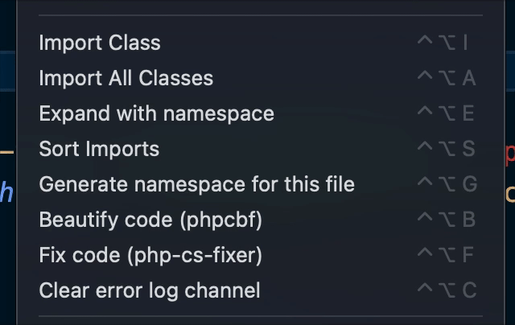
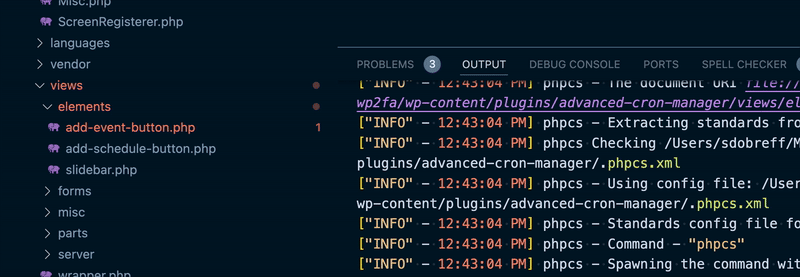
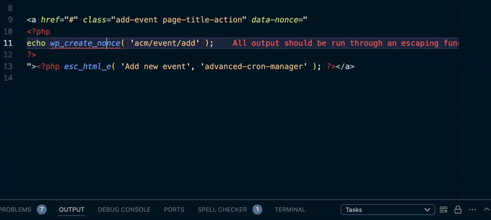

# PHP Resolver
<!-- 
[](https://marketplace.visualstudio.com/items?itemName=StoilDobreff.php-resolver.svg)
[](https://marketplace.visualstudio.com/items?itemName=StoilDobreff.php-resolver.svg)
[](https://marketplace.visualstudio.com/items?itemName=StoilDobreff.php-resolver.svg) -->

**PHP Resolver** is an extension which is using information from different PHP tools and help you resolve most of the **PHP problems**.
It's purpose is to try to provide all-in-one solution for resolving problems with your **PHP** source files.



- Automatically generates **PHP namespaces** for the given class based on the `composer.json`. Both **psr-4** and **psr-0** are supported.
- After namespaces importing, the classes are automatically collapsed.
- Extension supports **importing classes** not only from PSR4 and PSR0 but also **WordPress** format - `class-<name of the class>`. It automatically **checks for namespace declarations** in the files and extracts data from there.
- **PHP sniffer** - `phpcs` you can set your PHP sniffer and run it against the currently opened PHP file. For that to work you have to have the phpcf installed on your system.
- **PHP beautifier** - `phpcbf` extremely powerful PHP tool, which can help you to automatically fix most of the PHP code problems, and keep the code consistent with your team.
- **PHP Coding standards fixer** - support `php-cs-fixer` to resolve PHP problems using different set of rules.
- **PHP error log file monitor** - monitoring changes in the given PHP error log file, you can jump directly to the file and line from which the error comes from. On Fatal Errors, automatically switch Output view to the error log in order to grab your attention, OS notification is also fired in case you are alway of the VSCode window.
- Extension adds **file size info** in the status bar, which gives you quick information about the size of the current file.
- **DocBlock Generator** (PHP & Hack) - Automatically generates PHP/Hack docblocks with intelligent type detection, parameter documentation, and customizable templates.
- **Parameter Name Synchronization** - Keep your function parameter names and docblock parameter documentation in sync with bidirectional updates.
- **ZIP Archive Tools** - Create ZIP archives from files or folders and extract ZIP archives directly from VS Code.
- **Go to Definition** - Fast workspace-wide PHP symbol indexing (classes, functions, methods) with optional vendor support, persistent cache, and resolution tracing.


## PHP DocBlock Generator

The extension includes a powerful DocBlock generator for PHP and Hack files with the following features:

- **Auto-generation**: Press `Ctrl+Alt+D` to generate a docblock for the function/method/class below the cursor
- **Smart Type Detection**: Automatically infers parameter and return types from code
- **Tag Completion**: Start typing `@` in a docblock and get intelligent tag suggestions with snippets
- **Customizable Templates**: Configure default docblock formats via settings (`phpResolver.functionTemplate`, `phpResolver.propertyTemplate`, `phpResolver.classTemplate`)
- **Type Formatting**: Control type display with `phpResolver.useShortNames` and `phpResolver.qualifyClassNames` settings
- **Parameter Alignment**: Optionally align parameter documentation with `phpResolver.alignParams` setting
- **Custom Tags**: Add extra tags to all docblocks with `phpResolver.extra` setting
- **Author Information**: Automatically include author name and email from `phpResolver.author` setting

### Keybindings

- `Ctrl+Alt+D` - Insert PHP DocBlock
- `@` completion - Tag completion within docblocks

### Configuration Example

```json
{
    "phpResolver.gap": true,
    "phpResolver.returnGap": false,
    "phpResolver.defaultType": "[type]",
    "phpResolver.useShortNames": true,
    "phpResolver.alignParams": true,
    "phpResolver.author": {
        "name": "Your Name",
        "email": "your.email@example.com"
    },
    "phpResolver.extra": ["@license MIT"],
    "phpResolver.functionTemplate": {
        "message": "${summary}",
        "gap": true,
        "params": true,
        "return": true
    }
}
```

## Parameter Name Synchronization

When you modify function parameter names, you may want to keep your docblock in sync. This feature helps you maintain consistency between function signatures and their documentation.

### How It Works

The extension detects mismatches between docblock `@param` names and function parameter names for the nearest attached docblock-function pair.

Sync options:

1. **Sync Docblock → Function**: rename function params to match docblock names
2. **Sync Function → Docblock**: rename docblock `@param` names to match function names

Note: parameter sync is currently command-driven (`Ctrl+Alt+P`), not automatic lightbulb quick-fix.

### Usage: Keyboard Shortcut

1. Place your cursor inside the target function or its docblock
2. Press `Ctrl+Alt+P` or run the `phpResolver.syncParams` command
3. The extension matches the nearest docblock-function pair and shows sync options
4. Choose your sync direction from the quick-pick menu

### Examples

**Before Sync** (Mismatch detected - lightbulb appears):
```php
/**
 * Processes user data
 * @param $userData The user information
 * @param $options Configuration options
 */
public function processUser($userInfo, $config) {
    // ...
}
```

**After Docblock → Function Sync** (via lightbulb or Ctrl+Alt+P):
```php
/**
 * Processes user data
 * @param $userData The user information
 * @param $options Configuration options
 */
public function processUser($userData, $options) {
    // ...
}
```

Or **After Function → Docblock Sync**:
```php
/**
 * Processes user data
 * @param $userInfo The user information
 * @param $config Configuration options
 */
public function processUser($userInfo, $config) {
    // ...
}
```

### Keyboard Shortcuts
- `Ctrl+Alt+P` - Open sync dialog (manual mode with quick-pick menu)
- `Ctrl+Alt+D` - Insert/generate docblock

## ZIP Archive Tools

The extension can create ZIP files and extract ZIP archives.

### Browse ZIP Contents (Tree View)

Use command: `Open ZIP Contents` (`phpResolver.openZipContents`)

- Click a `.zip` file in Explorer and run **Open ZIP Contents** from context menu.
- When a `.zip` file is opened in the editor, the extension also auto-loads it into the **ZIP Contents** view.
- The tree displays folder structure with file metadata (size and modified date).
- Click any file in the ZIP tree to open it in a temporary preview file.
- Use the refresh button on the **ZIP Contents** view title to reload from disk.

### Create ZIP Archive

Use command: `Create ZIP Archive` (`phpResolver.createZip`)

- Run it from Explorer context menu on a file or folder, or from Command Palette.
- If no Explorer item is selected, the active editor file is used.
- You can choose the destination `.zip` filename and location.

### Extract ZIP Archive

Use command: `Extract ZIP Archive` (`phpResolver.extractZip`)

- Run it from Explorer context menu on a `.zip` file, or from Command Palette.
- You can extract to:
    - a default new folder next to the archive
    - or a custom destination folder

## Go to Definition

The extension provides built-in Go to Definition for PHP/Hack without requiring Intelephense.

## Phase 1 Navigation Modules

In addition to Go to Definition, Phase 1 includes:

- Find References
- Workspace Symbols
- Hover details (symbol kind, file, declaration line)

### What is indexed

- Classes, interfaces, traits
- Functions
- Methods
- Namespace + use/import aliases

### Performance model

- Incremental indexing (only changed files are reparsed)
- Optional persistent cache on disk for faster startup
- Optional vendor indexing for framework/library symbols

### Settings

- `phpResolver.enableDefinitionModule` (default: `true`)
    - Enable/disable PHP Resolver Go to Definition provider (requires window reload).
- `phpResolver.enableReferencesModule` (default: `true`)
    - Enable/disable Find References provider (requires window reload).
- `phpResolver.enableWorkspaceSymbolsModule` (default: `true`)
    - Enable/disable Workspace Symbols provider (requires window reload).
- `phpResolver.enableHoverModule` (default: `true`)
    - Enable/disable Hover provider (requires window reload).
- `phpResolver.enableRenameModule` (default: `true`)
    - Enable/disable safe Rename Symbol provider (class/function scope, requires window reload).
- `phpResolver.enableImplementationModule` (default: `true`)
    - Enable/disable Go to Implementation provider (class/method targets, requires window reload).
- `phpResolver.enableMissingUseModule` (default: `true`)
    - Enable/disable Auto Import / Fix Missing Use code actions module (requires window reload).
- `phpResolver.definitionSingleResult` (default: `true`)
    - Return only the top-ranked definition so Peek/hover definition lists stay deterministic.
- `phpResolver.definitionDeprioritizeNoopFiles` (default: `true`)
    - De-prioritize noop-like files (for example WordPress noop.php) during ranking.
- `phpResolver.definitionIncludeVendor` (default: `true`)
    - Include `vendor` in definition indexing.
- `phpResolver.definitionUsePersistentCache` (default: `true`)
    - Persist index cache between sessions.
- `phpResolver.definitionTrace` (default: `true`)
    - Write definition resolution details to output channel.

## Module Toggles

You can disable specific modules if you want to use only part of the extension.

- `phpResolver.enableDefinitionModule` (default: `true`)
    - Turns the built-in Go to Definition engine on/off.
- `phpResolver.enableDocblockModule` (default: `true`)
    - Turns DocBlock snippet generation/completion and param sync commands on/off.
- `phpResolver.enableRenameModule` (default: `true`)
    - Turns safe Rename Symbol (class/function scope) on/off.
- `phpResolver.enableImplementationModule` (default: `true`)
    - Turns Go to Implementation on/off.
- `phpResolver.enableMissingUseModule` (default: `true`)
    - Turns Auto Import / Fix Missing Use diagnostics + quick fixes on/off.

After changing any module toggle, run `Developer: Reload Window`.

### Commands

- `Clear Definition Cache` (`phpResolver.clearDefinitionCache`)
    - Clears index cache and rebuilds from workspace files.
- `Show Definition Trace` (`phpResolver.showDefinitionTrace`)
    - Opens output channel with resolver trace lines.
- `Show References Trace` (`phpResolver.showReferencesTrace`)
    - Opens output channel with Find References trace lines.
- `Show Implementation Trace` (`phpResolver.showImplementationTrace`)
    - Opens output channel with Go to Implementation trace lines.

### Trace output meaning

Trace entries include token, location, and match strategy, for example:

- `resolved-by=function`
- `resolved-by=class-token`
- `resolved-by=methodKey`
- `no-match`

This is useful to confirm a jump result comes from PHP Resolver and not another extension.

## Phase 1 Tests

Run the fixture-based tests locally:

```bash
npm run test:phase1
```

Current local tests validate:

- Reference matching excludes common comments/strings
- Symbol parsing for class/function/method declarations
- Provider delegation for references/workspace symbols/hover/rename/implementation
- **Phase 2 regression** (73 assertions):
  - `isValidPhpIdentifier` edge-cases (digits, hyphens, spaces, null)
  - `findClosestWordIndex` positioning accuracy
  - Inheritance parsing: extends, implements, use-aliases, multi-level chains, traits
  - `findDerivedClassRecords` graph traversal: direct, transitive, interface chains, unrelated exclusion
  - Reference regex safety: matches inside strings/comments are excluded
  - `extractClassParentsFromHeader` with namespace context and aliased imports

### Troubleshooting wrong function targets

If a function call (for example `add_action(...)`) resolves to an unrelated class/method file:

1. Run `Clear Definition Cache`.
2. Reload VS Code window (`Developer: Reload Window`).
3. Open `Show Definition Trace` and run Go to Definition again.
4. For function calls, ensure trace resolves with `resolved-by=function`.

If you still see incorrect results, temporarily disable other PHP language extensions and retry to isolate providers.

## Phase 2 Safe Refactoring

### Rename Symbol (Safe Refactor)

Safely rename PHP symbols (classes and functions) with workspace-wide reference tracking:

- **F2 or right-click → Rename Symbol** - Refactors all references to the selected class or function
- **Scope**: Classes and top-level functions only (methods excluded to prevent unintended refactors)
- **Auto validation**: Checks if the symbol can be safely renamed before offering the refactor UI
- **Configuration**: `phpResolver.enableRenameModule` (default true)

### Auto Import / Fix Missing Use (Code Actions)

Detect unresolved class references and offer quick fixes:

- **Detect unresolved names**: When you use a class name without a corresponding `use` statement
- **Code actions (Ctrl+.)**:
  - `Add use ClassName` - Inserts the use statement at the top of the file
  - `Use \Fully\Qualified\ClassName` - Replaces the name with fully-qualified namespace
- **Smart ranking**: Shows best matches first, limited to top 3 candidates
- **Configuration**: `phpResolver.enableMissingUseModule` (default true)

### Go to Implementation

Navigate from base symbols to concrete implementations:

- **Classes / Interfaces / Traits**: Shows derived classes and implementing classes
- **Methods**: On a base or interface method, shows overriding methods in derived classes
- **Trace support**: Use `Show Implementation Trace` to inspect resolution flow
- **Configuration**: `phpResolver.enableImplementationModule` (default true)

## Phase 3 Modules

Version 3.0 introduces a suite of advanced PHP intelligence modules, each independently toggleable.

### Code Lens (References & Implementations)

Shows inline reference and implementation counts above class, interface, trait, and function declarations.

- **"N references"** — click to see all usage locations
- **"N implementations"** — click to see derived/implementing classes
- Setting: `phpResolver.enableCodeLensModule` (default: `true`)

### Type Hierarchy

Native VS Code type hierarchy support (right-click → Show Type Hierarchy):

- **Supertypes** — navigate up to parent classes and implemented interfaces
- **Subtypes** — navigate down to child classes and implementors
- Powered by the persistent `parentToChildren` inheritance graph
- Setting: `phpResolver.enableTypeHierarchyModule` (default: `true`)

### Dead Code Scanner

Detect classes and functions with zero cross-file references:

- Run via command: `PHP Resolver: Run Dead Code Scan`
- Opens a full report with **clickable file paths** — click to jump to the symbol
- Results also appear in the Problems panel as Hint-severity diagnostics
- Excludes common framework patterns (controllers, migrations, test classes, etc.)
- Setting: `phpResolver.enableDeadCodeModule` (default: `true`)

### Document Symbol (Outline View)

Enhanced outline view showing classes, methods, properties, and constants with correct symbol kinds and hierarchy.

- Setting: `phpResolver.enableDocumentSymbolModule` (default: `true`)

### Inlay Hints (Parameter Names)

Shows parameter names inline at call sites, so you can see which argument maps to which parameter without checking the function signature.

- Setting: `phpResolver.enableInlayHintsModule` (default: `true`)

### Sort & Organize Imports

Groups and alphabetically sorts `use` statements with a single command:

- Command: `PHP Resolver: Sort and Organize Imports`
- Groups: classes, functions (`use function`), and constants (`use const`)
- Setting: `phpResolver.enableSortImportsModule` (default: `true`)

### Extract Interface

Code action to generate an interface from a class's public methods:

- Place cursor on a class → lightbulb → **Extract Interface**
- Creates a new interface file with all public method signatures
- Setting: `phpResolver.enableExtractInterfaceModule` (default: `true`)

### Circular Dependency Detection

Detects namespace-level circular import chains via DFS graph traversal:

- Command: `PHP Resolver: Check Circular Dependencies`
- Reports dependency cycles that may cause autoloading issues
- Setting: `phpResolver.enableCircularDependencyModule` (default: `true`)

### Namespace Completion

Autocomplete inside `use` statements — type a namespace prefix and get suggestions from the entire workspace index.

- Setting: `phpResolver.enableNamespaceCompletionModule` (default: `true`)

### PHPDoc Inheritance

Shows inherited PHPDoc on hover when a method doesn't have its own documentation but a parent/interface does.

- Setting: `phpResolver.enableDocInheritanceModule` (default: `true`)

### Unused Import Detection

Real-time diagnostics for unused `use` statements with quick-fix removal:

- Unused imports are highlighted with `Unnecessary` tag (faded out)
- Quick-fix: **Remove unused import** (single or all at once)
- Setting: `phpResolver.enableUnusedImportModule` (default: `true`)

## Performance Optimizations

Version 3.0 includes significant performance improvements:

- **Reverse token index** (`tokenToFiles`) — O(1) lookup for symbol references instead of scanning all files
- **Persistent inheritance graph** (`parentToChildren`) — instant subtype lookups without rebuilding
- **LRU file content cache** — avoids re-reading frequently accessed files from disk
- **Binary search** in offset range checks for faster symbol resolution
- **Lazy class records cache** with dirty tracking — rebuilds only when the index changes
- **Workspace folder caching** — eliminates repeated workspace folder lookups
- **Configuration caching** — reads settings once and invalidates on change
- **Incremental index updates** — only changed files are reparsed on save

## Namespace resolving

*Note for **WordPress** users:* there must be **composer.json** in the root of the project dir with either **psr-4** or **pcr-0** section defined, even if you are not following these standards, you can have composer.json file even if you are not using composer at all, but the extension depends on it. It is used for proper namespace generation. If you add one of these sections in your **composer.json** (or the file itself) that wont affect your project.

If there is a class which is part of the same namespace as the current one, it wont be added to the dialog (if there are multiple class candidates - check the `Expand with namespace` below) and it wont be added to the `use` section of the class.

- `Expand with namespace` command will expand the selected class with its **namespace**, if there are more than one class candidate - you have to make a manual selection via VSCode dialog.
  **Note**: if you close the dialog without making a selection, and `phpResolver.leadingSeparator` is set to true (default), **namespace** wont be added but the class will be prefixed with '\'.
- Currently partial namespaces are not supported. That means that if you have something like:

  ```
  use Namespace\DifferentParsers\Parser;

  ...

  $parser = new Parser\StringWalker($parseroptions);

  ```

  In this example *StringWalker* wont be recognized properly (as it has the following name (with namespace): Namespace\DifferentParsers\Parser\StringWalker). If you use `Import class` command - the extension will import just this - *use Parser\StringWalker*. If you remove *Parser\\* it will be imported properly (if the file with the class is found by the extension) or the import will look like this *use Namespace\DifferentParsers\Parser\StringWalker;*.
  Same applies for the `Import All Classes` command - it wont import classes properly, but it will work if you remove the *Parser\\* part.

## Linter Installation

Before using this plugin, you must ensure that `phpcs` is installed on your system. The preferred method is using [composer](https://getcomposer.org/) for both system-wide and project-wide installations. Another alternative is to install **phpcs** and **phpcbf** is to follow the instructions provided here: [PHP_CodeSniffer](https://github.com/squizlabs/PHP_CodeSniffer)

### PHP sniffer

**PHP sniffer** is extremely powerful tool for quick check your PHP code against given codding standards, which now you can use directly from the extension. For that to work properly, you have to provide the path to the executable (*phpcs*), which the extension can use. The command is `phpResolver.phpSnifferCommand` which expects string with the full path to the executable.
*Example:*

```json
{
    "phpResolver.phpSnifferCommand": "/usr/local/bin/phpcs"
}
```

PHP Resolver could be set as default formatter for PHP files. Use `Format Document With ...` menu (right click within PHP file in the VSCode), and then `Configure Default Formatter` menu.

### PHP beautifier

**PHP beautifier** is another powerful tool for resolving common PHP code problems using provided codding standards, which now you can use directly from the extension. For that to work properly, you have to provide the path to the executable (*phpcbf*), which the extension can use. The command is `phpResolver.phpBeautifierCommand` which expects string with the full path to the executable.
*Example:*

```json
{
    "phpResolver.phpBeautifierCommand": "/usr/local/bin/phpcbf"
}
```

### phpcbf and phpcs codding standards

Using the setting `phpResolver.phpStandards`, you have to provide the codding standards you want to be used with both PHP Beautifier, and PHP codding standards. This setting expects comma separated string values, with the standards you want to be used (they must be installed and visible for the executables - phpcs and phpcbf)
*Example:*

```json
{
    "phpResolver.phpStandards": "WordPress,WordPress-Extra,WordPress-Docs"
}
```

If your project is using custom standards as it is described here: [PHP_CodeSniffer - Using a Default Configuration File](https://github.com/squizlabs/PHP_CodeSniffer/wiki/Advanced-Usage#using-a-default-configuration-file), then you need to provide the full path to these configurations.
*Example:*

```json
{
    "phpResolver.phpStandards": "WordPress,WordPress-Extra,WordPress-Docs,/full-path-to-xml-file/phpcs.xml"
}
```

As of verion 2.2, you can use `phpResolver.phpCustomStandardsFile` setting to override the standards provided in `phpResolver.phpStandards`. There you can set the default file name used for custom XML standards used in your project. The extension will automatically try to search your project directory structure for that specific file, and apply it to the commands (if found). The default file name is `phpcs.xml`, but you can override it using that setting.
That means that you can have different standards in different directories of your project, but the name of the file should remain the same.

### PHP cs fixer

The extension supports `php-cs-fixer` which could format, check for common errors, resolve PHP problems in the PHP source files. For that to work properly, you have to have installed `php-cs-fixer` command, and that must be visible for the extension.

You can read about installing the php-cs-fixer [here](https://github.com/FriendsOfPHP/PHP-CS-Fixer#installation).

Extension has the following rules predefined out of the box (**json** format):

```json
{
    "@PSR12": false,
	"@Symfony": true,
	"indentation_type": true,
	"array_indentation": true,
	"array_syntax": {
		"syntax": "long"
	},
	"combine_consecutive_unsets": true,
	"class_attributes_separation": {
		"elements": {
			"method": "one"
		}
	},
	"multiline_whitespace_before_semicolons": false,
	"single_quote": true,
	"blank_line_after_opening_tag": true,
	"blank_line_before_statement": true,
	"braces": {
		"allow_single_line_closure": true,
		"position_after_functions_and_oop_constructs": "same"
	},
	"cast_spaces": false,
	"class_definition": {
		"single_line": true
	},
	"concat_space": {
		"spacing": "one"
	},
	"declare_equal_normalize": true,
	"function_typehint_space": true,
	"single_line_comment_style": {
		"comment_types": [
			"hash"
		]
	},
	"include": true,
	"lowercase_cast": true,
	"native_function_casing": true,
	"new_with_braces": true,
	"no_blank_lines_after_class_opening": true,
	"no_blank_lines_after_phpdoc": true,
	"no_blank_lines_before_namespace": false,
	"no_empty_comment": true,
	"no_empty_phpdoc": true,
	"no_empty_statement": true,
	"no_extra_blank_lines": {
		"tokens": [
			"curly_brace_block",
			"extra",
			"parenthesis_brace_block",
			"square_brace_block",
			"throw",
			"use"
		]
	},
	"no_leading_import_slash": true,
	"no_leading_namespace_whitespace": true,
	"no_mixed_echo_print": {
		"use": "echo"
	},
	"no_multiline_whitespace_around_double_arrow": true,
	"no_short_bool_cast": true,
	"no_singleline_whitespace_before_semicolons": true,
	"no_spaces_around_offset": true,
	"no_trailing_comma_in_list_call": true,
	"no_trailing_comma_in_singleline_array": true,
	"no_unneeded_control_parentheses": true,
	"no_unused_imports": true,
	"no_whitespace_before_comma_in_array": true,
	"no_whitespace_in_blank_line": true,
	"normalize_index_brace": true,
	"object_operator_without_whitespace": true,
	"php_unit_fqcn_annotation": true,
	"phpdoc_align": true,
	"phpdoc_annotation_without_dot": false,
	"phpdoc_indent": true,
	"general_phpdoc_tag_rename": true,
	"phpdoc_no_access": true,
	"phpdoc_no_alias_tag": true,
	"phpdoc_no_empty_return": false,
	"phpdoc_no_package": false,
	"phpdoc_no_useless_inheritdoc": true,
	"phpdoc_return_self_reference": true,
	"phpdoc_scalar": true,
	"phpdoc_separation": true,
	"phpdoc_single_line_var_spacing": true,
	"phpdoc_summary": true,
	"phpdoc_to_comment": true,
	"phpdoc_trim": true,
	"phpdoc_types": true,
	"phpdoc_var_without_name": true,
	"increment_style": true,
	"return_type_declaration": true,
	"short_scalar_cast": true,
	"single_blank_line_before_namespace": true,
	"single_class_element_per_statement": true,
	"space_after_semicolon": true,
	"standardize_not_equals": true,
	"ternary_operator_spaces": true,
	"trailing_comma_in_multiline": {
		"elements": [
			"arrays"
		]
	},
	"trim_array_spaces": false,
	"unary_operator_spaces": false,
	"whitespace_after_comma_in_array": true,
	"single_blank_line_at_eof": false
}
```

You can change / edit / fine-tune these in the settings.

Unfortunatelly there is no way to set white space formatting (**tabs** or **spaces**), using this settings. The only way is to extend the *php-cs-fixer* with your own class. For that reason extension also support class source which you can adjust / edit from the setting. The file will be saved within the extension directory under the name `user.resolver.fixer.config.php`.

Default class source code:

```php
<?php

return (new PhpCsFixer\Config())
    ->setRules([
   '@PSR12' => false, 
   '@Symfony' => true, 
   'indentation_type' => true, 
   'array_indentation' => true, 
   'array_syntax' => [
         'syntax' => 'long' 
      ], 
   'combine_consecutive_unsets' => true, 
   'class_attributes_separation' => [
            'elements' => [
               'method' => 'one' 
            ] 
         ], 
   'multiline_whitespace_before_semicolons' => false, 
   'single_quote' => true, 
   'blank_line_after_opening_tag' => true, 
   'blank_line_before_statement' => true, 
   'braces' => [
                  'allow_single_line_closure' => true, 
                  'position_after_functions_and_oop_constructs' => 'same' 
               ], 
   'cast_spaces' => false, 
   'class_definition' => [
                     'single_line' => true 
                  ], 
   'concat_space' => [
                        'spacing' => 'one' 
                     ], 
   'declare_equal_normalize' => true, 
   'function_typehint_space' => true, 
   'single_line_comment_style' => [
                           'comment_types' => [
                              'hash' 
                           ] 
                        ], 
   'include' => true, 
   'lowercase_cast' => true, 
   'native_function_casing' => true, 
   'new_with_braces' => true, 
   'no_blank_lines_after_class_opening' => true, 
   'no_blank_lines_after_phpdoc' => true, 
   'no_blank_lines_before_namespace' => false, 
   'no_empty_comment' => true, 
   'no_empty_phpdoc' => true, 
   'no_empty_statement' => true, 
   'no_extra_blank_lines' => [
                                 'tokens' => [
                                    'curly_brace_block', 
                                    'extra', 
                                    'parenthesis_brace_block', 
                                    'square_brace_block', 
                                    'throw', 
                                    'use' 
                                 ] 
                              ], 
   'no_leading_import_slash' => true, 
   'no_leading_namespace_whitespace' => true, 
   'no_mixed_echo_print' => [
                                       'use' => 'echo' 
                                    ], 
   'no_multiline_whitespace_around_double_arrow' => true, 
   'no_short_bool_cast' => true, 
   'no_singleline_whitespace_before_semicolons' => true, 
   'no_spaces_around_offset' => true, 
   'no_trailing_comma_in_list_call' => true, 
   'no_trailing_comma_in_singleline_array' => true, 
   'no_unneeded_control_parentheses' => true, 
   'no_unused_imports' => true, 
   'no_whitespace_before_comma_in_array' => true, 
   'no_whitespace_in_blank_line' => true, 
   'normalize_index_brace' => true, 
   'object_operator_without_whitespace' => true, 
   'php_unit_fqcn_annotation' => true, 
   'phpdoc_align' => true, 
   'phpdoc_annotation_without_dot' => false, 
   'phpdoc_indent' => true, 
   'general_phpdoc_tag_rename' => true, 
   'phpdoc_no_access' => true, 
   'phpdoc_no_alias_tag' => true, 
   'phpdoc_no_empty_return' => false, 
   'phpdoc_no_package' => false, 
   'phpdoc_no_useless_inheritdoc' => true, 
   'phpdoc_return_self_reference' => true, 
   'phpdoc_scalar' => true, 
   'phpdoc_separation' => true, 
   'phpdoc_single_line_var_spacing' => true, 
   'phpdoc_summary' => true, 
   'phpdoc_to_comment' => true, 
   'phpdoc_trim' => true, 
   'phpdoc_types' => true, 
   'phpdoc_var_without_name' => true, 
   'increment_style' => true, 
   'return_type_declaration' => true, 
   'short_scalar_cast' => true, 
   'single_blank_line_before_namespace' => true, 
   'single_class_element_per_statement' => true, 
   'space_after_semicolon' => true, 
   'standardize_not_equals' => true, 
   'ternary_operator_spaces' => true, 
   'trailing_comma_in_multiline' => [
                                          'elements' => [
                                             'arrays' 
                                          ] 
                                       ], 
   'trim_array_spaces' => false, 
   'unary_operator_spaces' => false, 
   'whitespace_after_comma_in_array' => true, 
   'single_blank_line_at_eof' => false 
])
     ->setIndent('	')
    ->setLineEnding('
')
;
```

*Note:* If there is a class source in the settings (default), that will be used with priority over the json settings.

## PHP Error Log

There is a PHP error log viewer built in the extension. When you provide the path to the **PHP error log** which has to be monitored from the extension (use `phpResolver.phpLogFile` setting for that), the extension will create a new output stream, and will start tailing the error log there. It is called **PHP Resolver - PHP error log**. Every time the PHP generates a **Fatal error**, the focus will be automatically moved to that output stream, so it can grab your attention immediately. The extension also generates a OS notification, which could be extremely helpful you are alway of your VSCode window. Click on the message in the notification, and you will be redirected to the VSCode window, and the file from which the error is originated will be opened for you and also the cursor will be moved to the line responsible for the error generated.
In the output console of the extension, you can click on the files and trace the error (use default VSCode key combinations for that - cmd-click for Mac and alt-click for Windows). When you click on given file, you will be redirected to that file and the cursor will be moved to the line related to the error generated.
In order for that to work properly, you have to manually provide the correct settings (if needed).

- If you working locally - just set `phpResolver.phpLogFile` to point to your error log file (absolute path and file name) and you are good to go. *Example:* **"/Users/your-user/MyProjects/project/log.log"**
- If your application is running remotely (vagrant, docker, etc.) you have to provide additional configurations
  - In that case, extension needs to map your error log paths to the local environment.
  - Use `phpResolver.phpLogFilePathRemote` to point to the root of your remote project directory. *Example:* **"/var/www/html/"**
  - Use `phpResolver.phpLogFilePathLocal`, to point to the root of your local project directory. *Example:* **"/Users/your-user/MyProjects/project/"**
  
## File size on hover in Explorer view

Extension supports filesize info, which is shown in the standard Explorer view on hover. Currently only supports files (not directories) - file of any type can be checked by just holding the mouse over the file and the size will be added in the hint in human readable format.



## PHPCS rules ignore

Extension supports inline rules ignore (using inline phpcs:ignore syntax) for the errors / problems collected from the phpcs. Multiple rules syntax is also supported and in use - just use Quick Fix menu, or go to problems tab.



## Commands

Search these commands by the title on command palette.

```javascript
[
    {
        "title": "Import Class",
        "command": "phpResolver.import"
    },
    {
        "title": "Import All Classes",
        "command": "phpResolver.importAll"
    },
    {
        "title": "Expand with namespace",
        "command": "phpResolver.expand"
    },
    {
        "title": "Sort Imports",
        "command": "phpResolver.sort"
    },
    {
        "title": "Generate namespace for this file",
        "command": "phpResolver.generateNamespace"
    },
    {
        "title": "Beautify code (phpcbf)",
        "command": "phpResolver.beautify"
    },
    {
        "title": "Fix code (php-cs-fixer)",
        "command": "phpResolver.fixer"
    },
    {
        "title": "Clear error log channel",
        "command": "phpResolver.clearErrorChannel"
    }
]
```

## Settings

You can override these default settings according to your needs.

```javascript
{
    "phpResolver.exclude": "**/node_modules/**",  // Exclude glob pattern while finding files
    "phpResolver.showMessageOnStatusBar": false,  // Show message on status bar instead of notification box
    "phpResolver.autoSort": true,                 // Auto sort after imports
    "phpResolver.sortOnSave": false,              // Auto sort when a file is saved
    "phpResolver.sortAlphabetically": false,      // Sort imports in alphabetical order instead of line length
    "phpResolver.sortNatural": false,             // Sort imports using a 'natural order' algorithm
    "phpResolver.leadingSeparator": true,         // Expand class with leading namespace separator
    "phpResolver.highlightOnSave": false,         // Auto highlight not imported and not used when a file is saved
    "phpResolver.highlightOnOpen": false,          // Auto highlight not imported and not used when a file is opened
    "phpResolver.autoImportOnSave": false,         // Auto import not imported classes when a file is saved
    "phpResolver.dontImportGlobal": true,          // Do not import global classes as aliases with use statement
    "phpResolver.phpBeautifierCommand": "",        // Full path to the PHP beautifier command
    "phpResolver.phpSnifferCommand": "",           // Full path to the PHP sniffer command
    "phpResolver.phpStandards": "",                // PHP standards (comma separated) which PHP Sniffer and Beautifier commands should use
    "phpResolver.phpCustomStandardsFile": "phpcs.xml", // The custom standards file to be used with the beautifier / sniffer.
    "phpResolver.phpLogFile": "",                  // Full path to the PHP error log file - you can set any PHP error log file to be monitored by the extension
    "phpResolver.phpLogFilePathRemote": "",        // If you are developing using remote environment (vagrant, docker, etc) put the path generated in the error log file on the remote, which has to be mapped to the local path in the error log monitor output (so the vscode could recognize the links, and resolves them to your local environment)
    "phpResolver.phpLogFilePathLocal": "",         // Local path which has to be used to replace the remote file path in the error log
    "phpResolver.addProtocolToLog": true,          // Different versions of the vscode are acting differently on resolving files links. From here you can remove 'file://' protocol from the log file output
    "phpResolver.lineNumberSeparator": "#",        // Different versions of the vscode are using different way to recognize line numbers in the links. From here you can change the separator ( usually # or : )
    "phpResolver.fixerConfigString": "..."         // The PHP object class which extends the php-cs-fixer. Check above - "default class source code".
    "phpResolver.phpFixerRules": object,           // JSON formatted fixer rules. Check above - PHP cs fixer.
    "phpResolver.errorLogTruncateSize": 1,         // Integer value (in megabytes), if error log file get over that size, it will be automatically truncated (to 0 bytes).
    "phpResolver.fileSizeOnHover": 1,              // Boolean value, set to true if you want extension to show the file size of every hovered file in the Explorer view. Default is true.
    "phpResolver.limitCodeLines": 3000,            // Integer value, extension now checks for the lines count of the current file and if it exceed that value, it wont run any checks on it (performance issues).
}
```

## Keybindings

You can override these default keybindings on your `keybindings.json`.

```json
[
    {
        "command": "phpResolver.import",
        "key": "ctrl+alt+i",
        "when": "editorTextFocus"
    },
    {
        "command": "phpResolver.importAll",
        "key": "ctrl+alt+a",
        "when": "editorTextFocus"
    },
    {
        "command": "phpResolver.expand",
        "key": "ctrl+alt+e",
        "when": "editorTextFocus"
    },
    {
        "command": "phpResolver.sort",
        "key": "ctrl+alt+s",
        "when": "editorTextFocus"
    },
    {
        "command": "phpResolver.highlightNotImported",
        "key": "ctrl+alt+n",
        "when": "editorTextFocus"
    },
    {
        "command": "phpResolver.highlightNotUsed",
        "key": "ctrl+alt+u",
        "when": "editorTextFocus"
    },
    {
        "command": "phpResolver.generateNamespace",
        "key": "ctrl+alt+g",
        "when": "editorTextFocus"
    },
    {
        "command": "phpResolver.beautify",
        "key": "ctrl+alt+b",
        "when": "editorTextFocus"
    },
    {
        "command": "phpResolver.fixer",
        "key": "ctrl+alt+f",
        "when": "editorTextFocus"
    },
    {
        "command": "phpResolver.clearErrorChannel",
        "key": "ctrl+alt+c",
        "when": "editorTextFocus"
    }
]
```

## Author

- [@StoilDobreff](https://github.com/sdobreff/)

Copyright (c) 2025 Stoil Dobreff

---

## Also by the Author

### 🔍 [0-day Analytics](https://wordpress.org/plugins/0-day-analytics/) — The Best Security & Monitoring Plugin for WordPress
discover what's really happening on your WordPress site behind the scenes.

Keep your WordPress site under control with real-time monitoring, security insights, and deep diagnostics that WordPress will never tell you about.

👉 [**Learn more about 0-day Analytics**](https://0-day-analytics.com/) — 
Things no one likes to talk about.